# raspi-temperature-controller
Simple binary ("bang-bang") temperature controller, based on Raspberry Pi and 1-wire sensor(s), with relay output(s), data and status logging, and optional cloud data sync

## Description

This simple temperature controller is based on low-cost and easy-to-build Raspberry Pi hardware, with 1-wire temperature sensor(s), and outputs via relay(s) that provide on/off control with hysteresis to the heating (or cooling) load(s).

This project includes both the software and a description of the hardware, including schematic and parts list. A simple example circuit is provided that uses an LED co-located with the temperature sensor for demonstration.

The controller software is configurable and flexible, capable of storing temperature from multiple sensors, and it stores data to a CSV datafile and controller operations to a logfile.  The controller can be run as a systemd service, or periodically from cron.  Using cron it is also easy to automate scheduled setpoint changes, log analysis and data upload to cloud.  Service files and crontab examples are provided.

This project is the basis of the system that has been controlling the central heating system in my flat since 2014 :) (https://aaronlockton.com/)

## Quick start guide

#### Install and run as a service

- Prepare [hardware](#hardware)
- Clone git repo and run [installer](install.sh) (must be run from repo root directory)

```
cd raspi-temperature-controller
sudo ./install.sh
```

- If 1-wire driver not previously installed, reboot to apply changes, otherwise log out and back in to enable aliases
- use aliases _g_, _s_, _a_, _s3_ to run set, get, analyse and sync described [below](#run-direct-from-repo-manual)
- The controller starts in an error state, and will start operating as soon as setpoint is set
- Note the first temperature reading after initially enabling 1-wire driver and rebooting [is not always valid](#known-issues), and should be manually ready with _g_ to flush before setting a setpoint
- edit _/etc/controller.conf_ to configure system as required
- edit _/etc/crontab_, uncomment required lines and set times and setpoints to automate setting setpoint, running analysis and syncing data to AWS S3
- Note installer will update apt repos and install required dependencies
- View outputs in _/var/log/temperature-controller_

#### Run direct from repo (manual)

- Clone git repo
- Ensure dependencies are installed (See [Requirements](#requirements), and user is in groups 'video' and 'gpio'
- Prepare hardware and ensure 1-wire driver is enabled in _/boot/config.txt_
- Run scripts using wrapper _temperature_controller.sh_ as shown below
- If required edit config file at _config/controller.conf_ (note _/etc/controller.conf_ will always take precedence if it exists

```
./temperature_controller.sh get - return current temperatures, setpoint and status to STDOUT
./temperature_controller.sh set [<temperature] - with argument set setpoint specified, with no argument get setpoint
./temperature_controller.sh control - run a single controller cycle and exit
./temperature_controller.sh control continuous - run control cycles continuously with wait interval specified in config
./temperature_controller.sh analyse - run controller log analysis to generate daily stats and plots (requires at least one full days data in controller log)
./temperature_controller.sh sync - sync data in output directory if enabled in config file (this is also run after 'analyse'
```

## Example outputs

Example outputs can be found in [examples](examples)

Temperature data is stored by default in a CSV file containing the setpoint and measurements from all configured temperature sensors, together with demand status. [an example file can be found here.](examples/temperature_data.csv) The file includes Excel-friendly date/timestamps to make plotting data easy:

[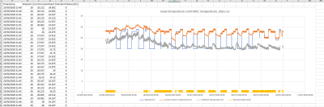](examples/raspi-temperature-controller-example-temperature-plot.png)[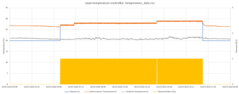](examples/raspi-temperature-controller-example-temperature-plot-zoom.png)[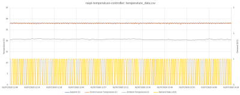](examples/raspi-temperature-controller-example-temperature-plot-zoom2.png)

In plots of temperature data as shown above, zoomed in plots show how the control sensor temperature closely follows the setpoint, with small variations due to hysteresis.  The individual switching events can also be seen in the demand signal.  Looking over longer timescales, it can be seen that again the control temperature closely following the changing setpoint, except when the setpoint is well below temperature, in which case the system is simply always off.  It can also be seen that during periods of time where ambient temperature is higher, the system stays off for several days.

The controller logfile (a snippet of which is shown below, and an [example can be found here](examples/control_temp.log)) stores a record of setpoint changes, switching events and any errors or warnings.  The _analyse_ function or _a_ command produces daily summary of controller behaviour, by analysing the controller logfile.  The analysis outputs are [a CSV with daily controller use in % and hours](examples/controller_analysis.csv) and plots showing daily demand in hours:

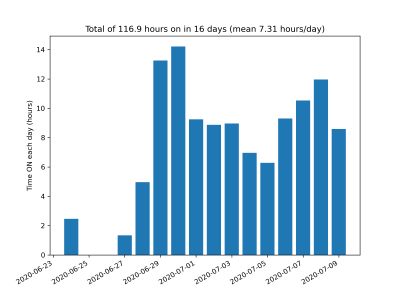 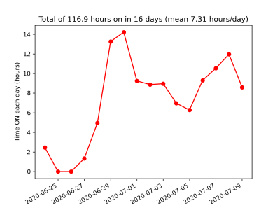 [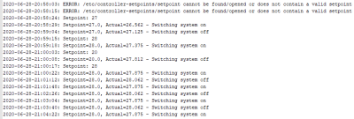](examples/raspi-temperature-controller-control_temp-log.png)

Example outputs in AWS S3 from the S3 sync function of the system can be found at http://raspi-cloud-public.s3-website.eu-west-2.amazonaws.com/

## Hardware

Before designing or building any hardware, read the [safety information](#important-safety-information).

The schematics in the [hardware](hardware) section includes an example project using a simulated heating system which employs an LED colocated with one of the temperature sensors to act as a heat source, thereby allowing the temperature controller functionality to be tested and demonstrated using a simple and easy to build breadboard circuit.  A [parts list](hardware/raspi-temperature-controller-breadboard_Simulation_Demo_Circuit_Parts_List.ods), [schematic](hardware/raspi-temperature-controller-breadboard_Simulation_Demo_Circuit_Schematic.pdf) and photos of this breadboard circuit can are all provided.  Simply obtain the parts on the parts list, build up the circuit as per the schematic and photos on a breadboard and plug in to a Raspberry Pi, and the system is ready to use as per the [quick start guide](#quick-start-guide).

To simulate a cooler instead of a heater, simply connect the 5 V rail to relay NC instead of NO.  In this arrangement, the demand signal switches off the LED, inverting the behaviour.

[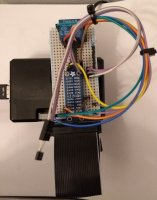](hardware/raspi-temperature-controller-breadboard-1.jpg) [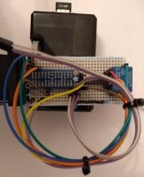](hardware/raspi-temperature-controller-breadboard-2.jpg) [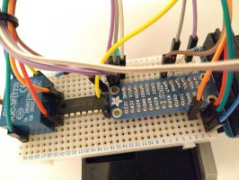](hardware/raspi-temperature-controller-breadboard-side-1.jpg) [](hardware/raspi-temperature-controller-breadboard-2.jpg)

#### Circuit description

The circuit uses a single 1-wire bus with as many temperature sensors as required for inputs.  The 1-wire sensors are open drain, so that multiple devices can share the same bus and all be able to communicate, and so a pull-up resistor (R1) is required.  Each 1-wire temperature sensor has a unique ID hard-coded into during manufacture so that they can be identified and individually read.

The output GPIOs from the Raspberry Pi cannot drive a relay directly, therefore a relay driver (IC1) is used.  A discrete transistor may also be used for this purpose, but the relay driver is convenient as it provides 8x channels in a single package, and includes "flyback" diodes to protect the transistors from back EMF produced by the relay coil during switching events.

The heating load is simulated by an LED (LED1) run at absolute max forward current (I<sub>F</sub>) of 25 mA.  This is set by current limiting resistor (R2) - since the LED has a forward voltage (V<sub>F</sub>) of 2.5 V, the supply voltage is 5 V and R2 is 100 Ohm, V = IR:
 - I<sub>F</sub> = V / R = (5 - 2.5) / 100 = 2.5 / 100 = 25 mA

Both the LED (LED1) and the resistor (R2) itself dissipate power P = I<sup>2</sup>R:
- P = I<sup>2</sup>R = 0.025 * 0.025 * 100 = 0.0625 W

Therefore R2 rated at 0.25 W provides sufficient safety margin to prevent the resistor running excessively hot.

#### Practical implementations

As well as the simple breadboard example circuit given above, a more general example [schematic](hardware/raspi-temperature-controller_Full-General_Variants_Schematic.pdf) is also shown, with multiple relays as well as multiple temperature sensors, thereby allowing multi-channel output control. This circuit also uses double pole relays, which gives an additional spare pair of contacts which can be fed back to a spare GPIO input (*GPIO_FEEDBACK* in the config file) allowing the controller to read the state of the relay and confirm the demand signal has been acted upon. This circuit also uses a separate supply for the relay coils, allowing use of coil voltages other than 5 V and removing the risk of overloading the Raspberry Pi 5 V rail when using multiple relays.  Note the relay coil supply must also have a common 0 V reference with Raspberry Pi supply. A version of this circuit built into a more industrial-controller style cabinet is shown in the photos in the [hardware](hardware) section:

[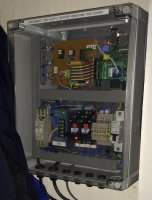](hardware/raspi-temperature-controller-industrial.jpg) [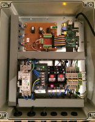](hardware/raspi-temperature-controller-industrial-lidoff.jpg)

## Software

Separate scripts are provided in _scripts_ directory to control setpoint from the command line, show latest readings and status, analyse the output from the controller to plot PNG graph of daily usage and upload to cloud.  A wrapper script _temperature_controller.sh_ can be used to access all these scripts, using settings in config file, or they can be called directly using command line arguments.  An overview of each script, including inputs and outputs can be found in the headers.

The installer _install.sh_ updates apt repo and installs dependencies (note this can take some time depending on when repo was last updated and what is already installed), sets.up users and groups, and copies all scripts and files to their respective locations. It sets up service files and starts and enables them on boot. It also adds example lines to /etc/crontab but these are commented to allow user to edit and enable as required. Note if an existing installation exists the existing controller config file, output directory and crontab lines will not be overwritten (however any custom paths/directories set in config will be ignored and defaults used). At the end, a summary of the install, any warnings (non-fatal errors) that occurred and next steps to get started. If a fatal error occurs it will abandon the installation and exit immediately. If not already present, the device-tree overlay for 1-wire devices will be enabled, and this requires a reboot to apply changes.  Note the very early Raspberry Pi OS distributions do not use device tree.

Note in order to control GPIO the user must be in 'gpio' group and for _g_ or _temprt_ to return CPU temperature the user must be in 'video' group. To allow both use of command line tools and automated running via cron/services, user(s) must be in 'tempctl' group, and vice versa. This is set up by _install.sh_, which first creates 'tempctl' user.  This allows all controller functions to be used from command line without sudo/root. Similarly, all the controller service and cron tasks are all run as 'tempctl' user, since it is better practice for security to avoid running processes as root where possible.  For example, running the controller process with minimum possible privileges reduces the harm that could be done by an attacher attempting to inject malicious code into the system configuration file.  The only script that requires sudo/root privileges is _install.sh_ which is only run once.

When running as a systemctl service, the service will automatically restart when config file is edited or setpoint modified to apply the changes

Optionally, the controller syncs all data in the outputs directory (logs, data, daily analysis) to Amazon AWS S3. This must be enabled in the [config file](#configuration-file), and an S3 bucket URL must be provided. Optionally, the data can be made public, and very simple HTML is included to demonstrate publishing data using S3 static web content hosting feature. **Note this means the data is accessible to anyone on the Internet** but it does require public access to be allowed in AWS IAM as well. All users running analysis/S3 sync must have RW access to the specified S3 bucket configured in IAM (including 'tempctl' user for system itself).  There are lots of ways of managing AWS permissions using IAM (and lots of pitfalls and mistakes are frequently made - especially with S3!). AWS IAM is documented elsewhere in detail and well beyond scope of this guide. But great care should be taken, especially when allowing public access to any S3 resources. It is wise to lock down access to a specific IP address or range. One simple (crude) way to achieve access for controller system and users is to add S3 access keys to controller config file using _export AWS_ACCESS_KEY_ID= / export AWS_SECRET_ACCESS_KEY=_ but this is not ideal as the credentials are stored in plain text on the controller file-system and accessible to all users in 'tempctl' or with root privileges.

Note aliases _s_, _g_, _a_, _s3_ require a login shell in order to work.

Note the controller uses UTC throughout for all timestamps, and it is assumed OS timezone is UTC. Although internally controller uses UTC in all logs and outputs, OS features such as cron will of course depend on configured OS timezone. OS timezone can be set to UTC using _sudo timedatectl set-timezone UTC_

#### Control strategy

The controller itself can be found at _scripts/control_temp.py_ and details of input arguments can be found by running _scripts/control_temp.py -h_. The basic control strategy is running control cycles which can be triggered manually or in continuous mode will be run repeatedly with a specified wait interval in seconds between cycles. Each cycle, temperature will be read from all available/configured sensors, and the setpoint and control temperature sensor measurement are compared. If a list of sensor IDs is supplied, the first on the list will be used as the control sensor.

In heating mode (default), if the control sensor temperature is greater than or equal to the setpoint and the system is on then it will be switched off.  If the control sensor temperature is less than the setpoint minus the hysteresis value, and the system is off then it will be switched on.  This was based on empirical testing with systems such as domestic central heating systems which react quicker to switching on demand than to switching off (due to heat stored in radiators).  In cooler mode, the switch on point is setpoint plus hysteresis and switch off point is the setpoint.

Note concept of hysteresis is fundamental to a binary control system such as this, since it prevents instability and frequent unnecessary switching of the load caused by fluctuations in or accuracy of the measured temperature value, and ensures a "clean" switch on and switch off.  Too frequent switching or an excessive number of switching cycles may ultimately damage the heating or cooling system under control.

#### Configuration file

The system configuration file is normally located at _/etc/controller.conf_ (or [_config/controller.conf_](config/controller.conf) if running straight from repo and not installed - but note _/etc/controller.conf_ always takes precedence if it exists).  Additionally, an alternative config file can be specified by setting environment variable _CONFIG_FILE_ before calling the scripts - this takes precedence over both defaults.  Full details of each key can be found in the comments within the [sample config file](config/controller.conf) provided.

- _"## Path settings"_ contains paths to the various files and directories required by the controller.  These are set up by the installer automatically, and do no normally need to be changed (unless using multi-channel control outputs)
- _"## GPIO pins"_ specifies the output pins to be used for output demand signal, and optional feedback input to confirm demand has been changed.  These can be left at default for the example schematic
- _"## Settings for temperature sensor(s)"_ contains IDs and labels for all temperature sensors.  They can be left empty "()", but are especially useful if multiple sensors are connected to ensure the correct sensor is used for control (first in the list).  Every DS18B20 sensor has a unique 64-bit ID, and if given these must appear in the config file in the form "28-nnnnnnnnnnnn".  They can be found using _ls /sys/bus/w1/devices/_ and should appear in WIRED_SENSORS separated by spaces and enclosed in brackets "()".  The labels WIRED_SENSOR_LABELS are only used in the CSV temperature data column headers when a new datafile is created (the old file must be moved or deleted in order for a new one to be created)
- _"## Options for control and logging"_ sets the controller parameters - hysteresis, whether it is controlling a heating or cooling system and the wait time in seconds between each cycle
- _"## Options for log analysis"_ sets the date range over which log analysis is carried out for the daily controller data and plots. These dates can be input in any format that can be understood by GNU _date_ (e.g. "3 weeks ago") and should be enclosed in quotes "".  The default settings should analyse the entire logfile.  Note analysis is in whole days so must start and end on a midnight crossing.
- _"## AWS settings"_ - Enable / configure AWS S3 sync - see above in "Software" section

#### Multi-channel control

The hardware described includes an 8-channel relay driver, therefore by connecting multiple GPIO outputs to this IC in the same way as the single channel example it is possible to enable up to 8 control channels. In fact the controller is scalable to as many output channels as there are free GPIO pins. Multiple temperature input channels can easily be read since all sensors are on a common bus. Any available temperature sensor may be used to control any output channel. Each output channel is controlled by a separate instance of the controller software. An example schematic showing multi-channel control is shown [here](hardware/raspi-temperature-controller_Full-General_Variants_Schematic.pdf). To enable an additional control channel in software:

- Create a new config file in /etc for the additional channel, and edit the _## Path settings_ section with suitable unique files and directories, including specifying a setpoint file (must be located in _/etc/controller-setpoints/_, owned by tempctl and group writable) and an output directory (make sure the output directory exists, and also owned by tempctl and group-writable)
- Enable/start an additional systemctl service (for config file _/etc/<config-filename>_):

```
sudo systemctl restart temperature-controller@<config-filename>.service
sudo systemctl restart temperature-controller-restarter@<config-filename>.path
sudo systemctl enable temperature-controller@<config-filename>.service
sudo systemctl enable temperature-controller-restarter@<config-filename>.path
```

- Warning - if <config-filename> does not exist, the new controller process will default to _/etc/controller.conf_ which may result in multiple processes running simultaneously using same config
- Run individual scripts preceded by setting CONFIG_FILE variable - e.g. _CONFIG_FILE=/etc/<config-filename> /opt/scripts/temperature-controller/temperature_controller.sh get_
- Note default alias setup supplied (_s_, _g_, _a_, _s3_) will only work for primary controller service with config at default /etc/controller.conf - additional aliases can be created if required
- Note any changes to a setpoint from any processes will result in all controller services being restarted
- Multi-channel control with multiple processes running may occasionally cause [issues with sensor communications](#known-issues)

## Requirements

- Raspberry Pi with suitable hardware as [described above]((#hardware))
- Raspberry Pi OS (formerly known as Raspbian) - may work with other operating systems, particularly Debian based, but this is untested.  Recommend latest "Raspberry Pi OS (32-bit) Lite" from https://www.raspberrypi.org/downloads/raspberry-pi-os/
- _bc_ and _awscli_ packages installed
- Python3 (will run on Python2 if headers in Python scripts changed accordingly), with Python3 module _matplotlib_ (must be installed for all users).  Note package _libatlas-base-dev_ may be required to enable _matplotlib_
- Write access to an Amazon AWS S3 bucket (if S3 data sync is enabled) for _tempctl_ user and any interactive users

All required dependencies that are not present on the current Raspberry Pi OS image will be installed by _install.sh_.  Note there may be conflicts if _matplotlib_ is already installed for the user only.

## Known issues

- The first sample read from the 1-wire sensors on startup is not always valid.  This mainly appears to happen when 1-wire driver is first installed, but reading and discarding a sample on power up / system boot may be advisable in some applications
- The 1-wire data given by the _temprt_ script called using the interactive 'get' command or _g_ alias is not checked for CRC / validity.  This is not the case for the controller, which checks all temperature data before acting upon  it for control or storing it
- In some cases a loss of communications to some or all temperature sensors has been observed, requiring full system power cycle (reboot does not fix).  This appears related to issues with multiple processes all reading same sensor at the same time so it may be advisable to not read the same sensors multiple times in different processes, and specifically configure sensor IDs in config file when using multiple control channels

## IMPORTANT SAFETY INFORMATION

The example circuits given in this project do not contain any voltages above 5 Volts.  If being used to control a real heating/cooling load there are several **VITAL** safety considerations which **MUST** be adhered to:

- Heater or cooler must have over/under-temperature protection and be safe to leave "ON" permanently. It must have automatic and manual E-stop circuitry (independent to this controller) to shut it down in the event of any controller or heater/cooler malfunction, over/under temperature, etc.  The hardware and software described above **CANNOT** be relied upon to switch the load off under all circumstances (e.g. running periodically in cron the line may be removed/commented; if system is mis-configured or service is stopped - note to prevent brief interruption to demand signal stopping/restarting service does **NOT** switch off demand; or if any failure occurs in the controller hardware or software)
- Any wiring or circuitry that includes potentials above 50 V should be built (or at minimum checked and approved by) a qualified electrician
- It is recommended to use suitably certified commercial-off-the-shelf parts to wire up any voltages exceeding 50 V (e.g. relay boards, terminals, wiring to load, etc).  **NEVER** use prototyping boards such as breadboard or Veroboard to handle mains voltages under any circumstances!
- Ensure proper circuit protection is in place (MCBs for over-current, RCD protection for Earth/ground leaks, etc)
- Ensure proper Earthing/grounding of all supplies to and from all system components, ensure all metal parts and enclosures are properly bonded to Earth/ground
- Ensure all voltages above 50 V are carried using properly insulated wires and cable rated for the voltage and current in use.  Ensure no exposed voltages are present or can be accessed when the system is powered on, and all voltages above 50 V are only present inside properly designed enclosures.
- Ensure all system components are completely isolated from all supplies before being worked on in any any way or removing any covers.

Use of the hardware and software in raspi-temperature-controller is entirely at your own risk!

raspi-temperature-controller is released in loving memory of Sidney Lockton (1940 - 2020)
